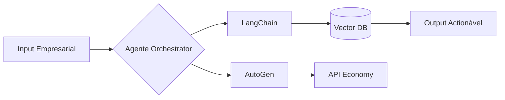

```mermaid
graph LR
    A[Input Empresarial] --> B{Agente Orchestrator}
    B --> C[LangChain]
    B --> D[AutoGen]
    C --> E[(Vector DB)]
    D --> F[API Economy]
    E --> G[Output Actionável]
```
