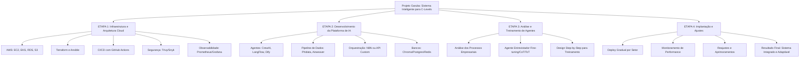

```mermaid
graph TD
    A[Projeto Garuba: Sistema Inteligente para C-Levels]
    
    A --> B[ETAPA 1: Infraestrutura e Arquitetura Cloud]
    B --> B1[AWS: EC2, EKS, RDS, S3]
    B --> B2[Terraform e Ansible]
    B --> B3[CI/CD com GitHub Actions]
    B --> B4[Segurança: Trivy/Snyk]
    B --> B5[Observabilidade: Prometheus/Grafana]

    A --> C[ETAPA 2: Desenvolvimento da Plataforma de IA]
    C --> C1[Agentes: CrewAI, LangFlow, Dify]
    C --> C2[Pipeline de Dados: Phidata, Airweaver]
    C --> C3[Orquestração: N8N ou API Custom]
    C --> C4[Bancos: Chroma/Postgres/Redis]

    A --> D[ETAPA 3: Análise e Treinamento de Agentes]
    D --> D1[Análise dos Processos Empresariais]
    D --> D2[Agente Entrevistador Fine-tuning/CoT/ToT]
    D --> D3[Design Step-by-Step para Treinamento]
    
    A --> E[ETAPA 4: Implantação e Ajustes]
    E --> E1[Deploy Gradual por Setor]
    E --> E2[Monitoramento de Performance]
    E --> E3[Reajustes e Aprimoramentos]

    E --> F[Resultado Final: Sistema Integrado e Adaptável]
```

