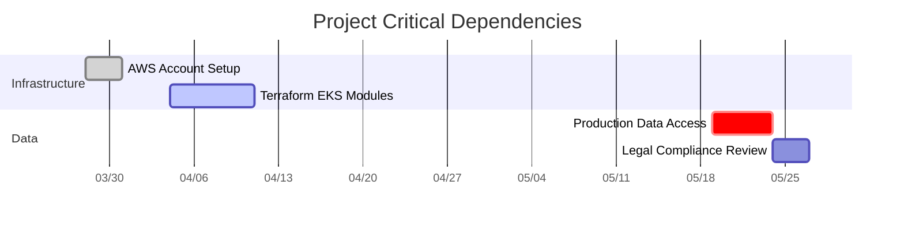
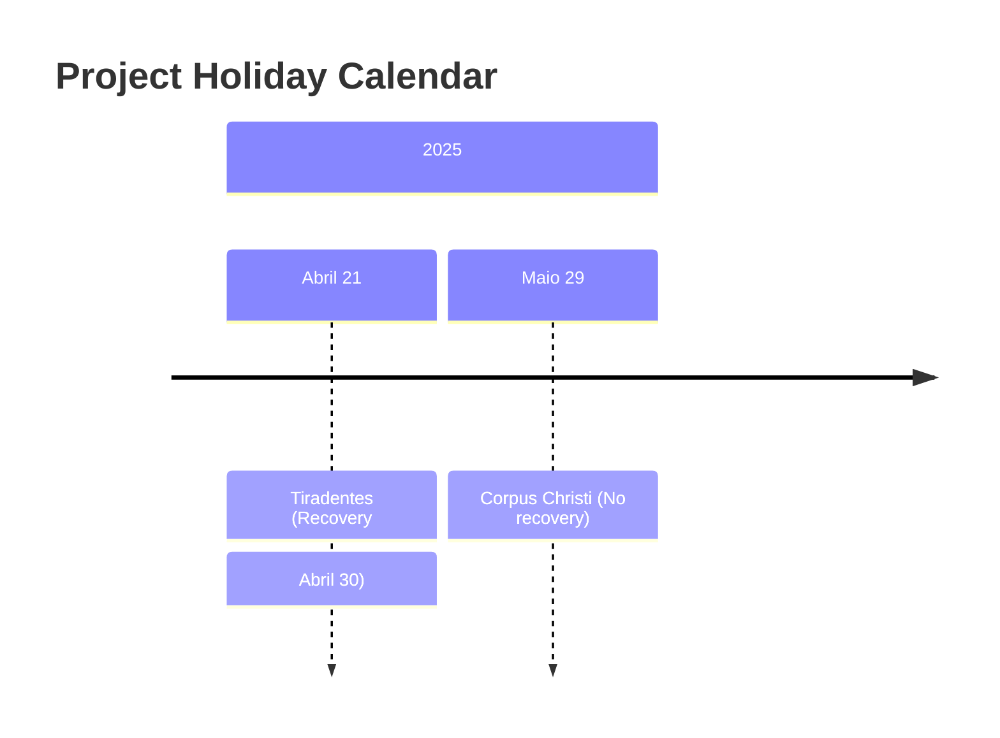

# Cronograma do Projeto - Plataforma de Agentes de IA para Gestão Empresarial

**Período**: 31 de Março a 30 de Junho de 2025  
**Dias de desenvolvimento**: Segunda, Quarta e Quinta-feira (manhã)  
**Horário**: 8h às 12h  

## 📅 Março-Abril 2025

| Seg | Qua | Qui | Atividades-Chave                          |
|-----|-----|-----|------------------------------------------|
| 31  |     |     | ✅ **Kick-off do projeto** • Setup AWS/Git • Definição de SLOs |
|     | 2   | 3   | 🛠️ **Infraestrutura (Fase 1)** • Terraform: EKS cluster • Ansible base config |
| 7   | 9   | 10  | 🔐 **Segurança** • IAM roles • Network policies • Trivy scanning |
| 14  | 16  | 17  | 📦 **Deploy Inicial** • Airweave Helm chart • Smoke tests |
| 21  | 23  | 24  | 🤖 **Integração LangFlow** • Model connectors • API gateway setup |
| 28  | 30  | 1/5 | 🔄 **n8n Workflows** • CRM/ERP integrations • Alert automation |

---

## 📅 Maio 2025

| Seg | Qua | Qui | Atividades-Chave                          |
|-----|-----|-----|------------------------------------------|
| 5   | 7   | 8   | 🧪 **Testes** • Load testing (Locust) • Security penetration tests |
| 12  | 14  | 15  | 📊 **Monitoramento** • Prometheus alerts • Business metrics dashboards |
| 19  | 21  | 22  | 🏭 **Process Mapping** • User interviews • BPMN diagrams |
| 26  | 28  | 29  | ✨ **Otimizações** • Cost reduction • Auto-scaling tuning |

---

## 📅 Junho 2025

| Seg | Qua | Qui | Atividades-Chave                          |
|-----|-----|-----|------------------------------------------|
| 2   | 4   | 5   | 🚀 **Preparação Final** • Demo video recording • Documentation polish |
| 9   | 11  | 12  | 🎯 **Validação** • User acceptance tests • Stakeholder review |
| 16  | 18  | 19  | 📑 **Entrega Acadêmica** • Paper submission • Presentation dry-run |
| 23  | 25  | 26  | 🌟 **Conclusão** • AWS cleanup • Startup roadmap |

---

# 🚨 Attention Points - AI Agents Platform Project

### 1. **Working Windows**
- **Core Hours**: 8:00-12:00 (Morning focus)
   - Manhãs (8h-12h) com foco total
   - Tardes reservadas para reuniões/ajustes
  - Development work only
  - No meetings allowed
- **Afternoons (13:00-17:00)**:
  - Team syncs
  - Adjustments
  - Documentation

### 2. **Key Dependencies**

## 3. **Holiday & Contingency Planning**
### 3.1 Official Holidays

### 3.2 Impact Mitigation
- Holiday	Affected Sprint	Compensation Strategy
- Tiradentes	Sprint 3	Extended work window Apr 30 (8h-18h)
- Corpus Christi	Sprint 6	Pre-delivery of artifacts on May 28

## 4. Performance Benchmarks
### 4.1 Quantitative Targets
pie
    title KPI Weight Distribution
    "Test Coverage" : 25
    "Latency" : 35
    "Uptime" : 30
    "Cost" : 10

--- sera reestrutura os proximo passos

📌 Métricas de Progresso
KPI	Meta	Ferramenta de Medição
Cobertura de Testes	≥85%	SonarQube
Uptime EKS	99.95%	CloudWatch SLAs
Latência Agentes	<200ms	Grafana/Prometheus
Custo Mensal	<$300	AWS Cost Explorer
Notas Adicionais:

Daily standups às 8h15 nos dias de trabalho

Versionamento semanal do Terraform state

Backup diário do cluster (Velero)
