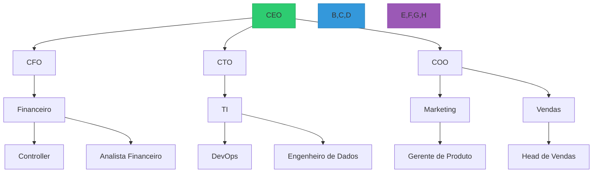

```mermaid

graph TD  
    A[CEO] --> B[CFO]  
    A --> C[CTO]  
    A --> D[COO]  
    B --> E[Financeiro]  
    E --> E1[Controller]  
    E --> E2[Analista Financeiro]  
    C --> F[TI]  
    F --> F1[DevOps]  
    F --> F2[Engenheiro de Dados]  
    D --> G[Marketing]  
    G --> G1[Gerente de Produto]  
    D --> H[Vendas]  
    H --> H1[Head de Vendas]  
    style A fill:#2ecc71,stroke:#27ae60  
    style B,C,D fill:#3498db,stroke:#2980b9  
    style E,F,G,H fill:#9b59b6,stroke:#8e44ad  
```
